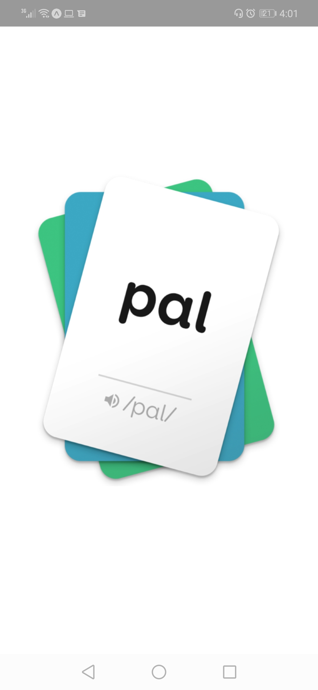
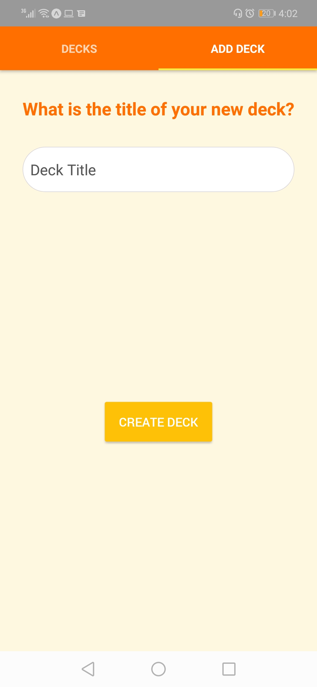
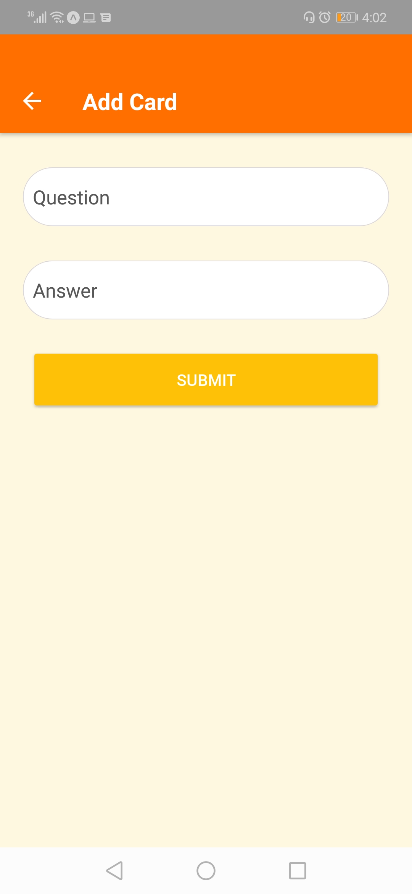
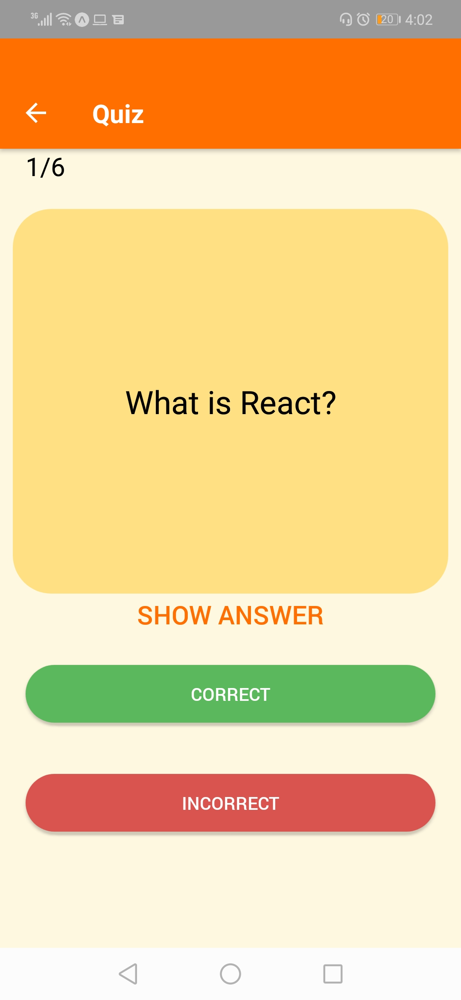
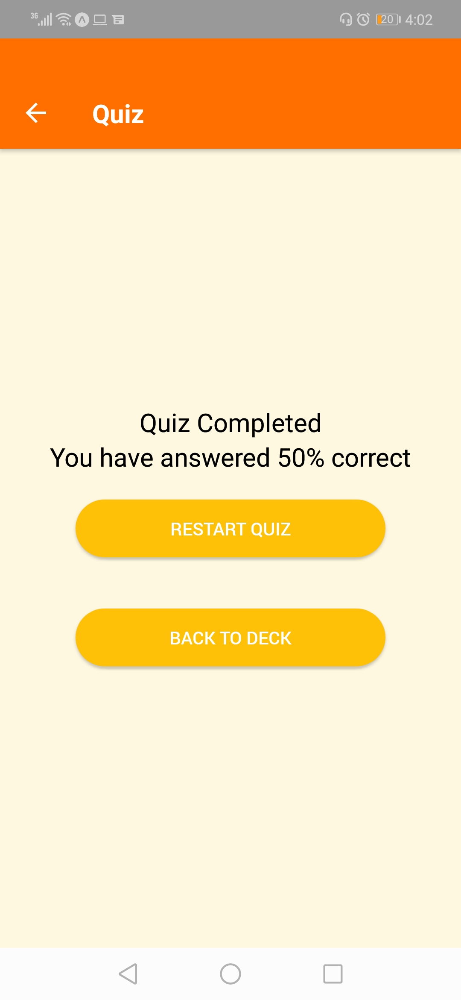

# Mobile Flashcards
This React Native project is requirement of Udacity's React, ReactNative & Redux course of React Nanodegree -- nd019

## Installation Instructions

Run following commands in project home folder

npm install

npm start

## Tested Platform

Tested on Android Platform

## Screen Shots

Splash Screen

Home Screen

Add Deck Screen

Add Card Screen

Quiz Screen

Quiz Completed Screen

